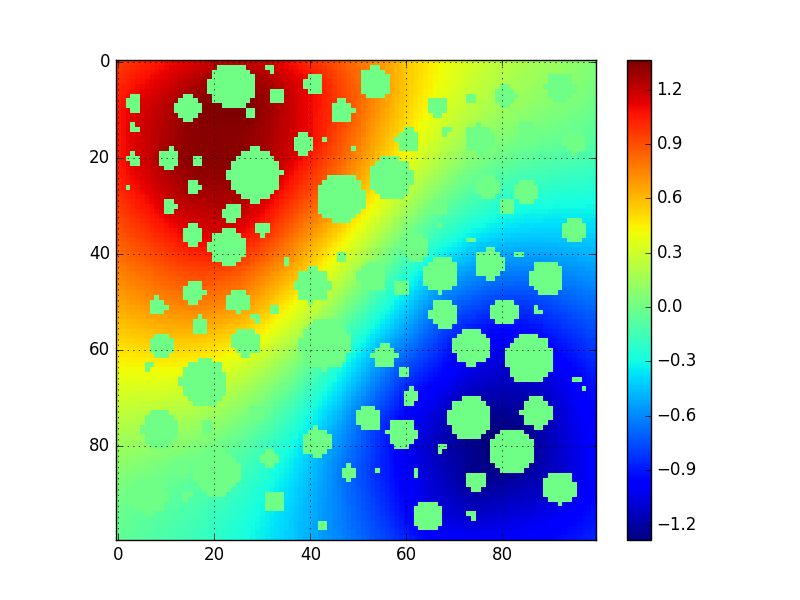

# HPC with Python

There are a few different paradims in parallel programming. Distributed memory programming, Shared memory programming.

**MPI** is a standard for distributed memory programming. For certain size of problems, you can not even slove them, because of running out of memory.

* programming can be a tedious task.
* programming in parallel can be extramely tedious

There are not many people using python to do parallel computing. It is admitted a lot slower than C and fortran. And when parallel programming is so difficult. Using Python, at least for prototyping, it is great.

There are two methods for message passing in **mpi4py**. One is pickle, or numpy array, and the latter one is faster.

## Install Open MPI and mpi4py
To get things run on a clear osx is a tedious work, and it all starts with Xcode installation.

* Install GUN compiler on Max OS X
	1. We begin with installing the current version of 		apples's **Xcode** software, which can be done 
		in app store.
	2. Next critical step is to install **command line 		tools**. To do this, open a terminal, and type 
		`xcode-select --install`.
	3. Download **GNU compiler** from HPC for Max OS X 		website. Choose the current stable version of
		gcc compilers.
	4. Install GNU compiler by using **sudo**. Type 
		`tar -xvf gcc-5.3-bin.tar -C /`
		to install GNU in `/usr/local`.
	5. Now we can check compiler version to make sure it 		was installed correctly.
	6. One extra thing might need to be done is to open 		Xcode for the very first time, if you haven't 		done so to let it configure itself, and take 		care of the license issue.
	
* Install Open MPI on Mac OS X
	(MPI is the interface that helps to computer nodes 	talk to each other in parallel computations. Here we   	are going to install one of the freely available 	MPI implementations on Max OS X.)
	1. Download source file of **Open MPI**, and unzip 		it by `tar zxvf openmpi-x.x.x.tar.gz`.
	2. Configurate it by typing `./configure --prefix=/		usr/local`, if only one set of compiler is 		installed, which we just did.
	3. Now compile the code by using `make all`
	4. If the code compiles without any issue, then we 		can install Open MPI by typing `sudo make 		install`.
	 
* Install mpi4py on Mac OS X
	(MPI for Python provides an object oriented approach to message passing which grounds on the standard MPI-2 C++ bindings.)
	1. Use Anaconda to install `conda install -c mpi4py 		mpi4py=2.0.0`. At this point, probably you could 		get everything run. On my personal computer, I 		got 
		`Fatal error in MPI_Init_thread: `
		
	2. The other way to do it is 
		`pip install mpi4py`, which probably would work. 		Before that, you probably need to uninstall 		`conda uninstall mpi4py`.
		
## Install MPICH2 

(for some reason, I also tried to install MPICH2)
	
## Make Spyder Work

Up to here, you should expect Python would be able 	to use MPI to communicate. But to run example code 	in Spyder, it only gives output from processor 0.
	
## Simple Test Code
* Test processer rank is working

	```
	from mpi4py import MPI
	comm = MPI.COMM_WORLD
	rank = comm.Get_rank()
	print ("hello world from process ", rank)  
	```
		
	The result you should expect is
		
	```
	mpiexec -n 2 python ***.py 
	hello world from process  0
	hello world from process  1
	```
* Test communication
		
	```
	from mpi4py import MPI
	comm = MPI.COMM_WORLD
	nprocs = comm.Get_size()
	rank   = comm.Get_rank()
	if rank == 0:
   		data = 'Hello!'
   		comm.send(data, dest=nprocs-1, tag=1)
	elif rank == nprocs-1:
   		data = comm.recv(source=0, tag=1)
   		print ('Rank ', rank, ' received ', data)
   	```
   	
   	The result you should expect is
   	
   	```
   	mpiexec -n 2 python ***.py 
	Rank  1  received  Hello!
	```
## Error Message
```
Fatal error in MPI_Init_thread: Other MPI error, error stack:
MPIR_Init_thread(474)..............: 
MPID_Init(190).....................: channel initialization failed
MPIDI_CH3_Init(89).................: 
MPID_nem_init(320).................: 
MPID_nem_tcp_init(173).............: 
MPID_nem_tcp_get_business_card(420): 
MPID_nem_tcp_init(379).............: gethostbyname failed, Hais-MacBook-Air.local (errno 1)
```
* To fix this issue, it is actually not that hard. Make sure 
	1. Your terminal hostname
	2. "/etc/hosts" hostname
	
	They are the same. So if you type `cat /etc/hosts` 	in terminal, it should look like:
	
	```
	// 127.0.0.1		my_hostname
	```
	To change terminal hostname type the following:
	
	```
	sudo scutil --set HostName my_new_host_name
	```
	
	To change your hostname type the following:
	
	```
	sudo vim /etc/hosts
	```
	Then add the line
	
	```
	127.0.0.1       my_new_hostname
	```
	
## Numerical Results
With serial code

```
	u
array([[ 0.95867847+0.j,  0.97217599+0.j,  0.98554438+0.j, ...,
         0.07694889+0.j,  0.06784473+0.j,  0.05896428+0.j],
       [ 0.97017564+0.j,  0.98438906+0.j,  0.99844272+0.j, ...,
         0.07196040+0.j,  0.06251391+0.j,  0.05336643+0.j],
       [ 0.98175057+0.j,  0.99676456+0.j,  1.01157219+0.j, ...,
         0.06672009+0.j,  0.05687804+0.j,  0.04744653+0.j],
       ..., 
       [-0.03096589+0.j, -0.03862722+0.j, -0.04641769+0.j, ...,
        -0.90647485+0.j, -0.89484243+0.j, -0.88315452+0.j],
       [-0.03697276+0.j, -0.04439484+0.j, -0.05192936+0.j, ...,
        -0.89483705+0.j, -0.88400515+0.j, -0.87307897+0.j],
       [-0.04281760+0.j, -0.05004802+0.j, -0.05738627+0.j, ...,
        -0.88337531+0.j, -0.87325975+0.j, -0.86302550+0.j]])
```

With parallel code

```
hszhu:python_code haizhu$ mpiexec -n 2 python test_reduce.py 
****** 0/2 processor gets local data ****
(7841,)
[0] [ 0.95867847+0.j  0.97017564+0.j  0.98175057+0.j ..., -0.88315452+0.j
 -0.87307897+0.j -0.86302550+0.j]
2.0946132359968033
****** 1/2 processor gets local data ****
(7841,)
[1] None
```

Graph results

